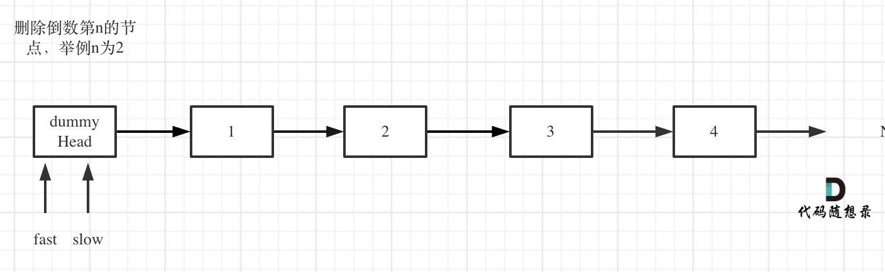

# 删除链表的倒数第N个节点

[19. 删除链表的倒数第 N 个结点](https://leetcode.cn/problems/remove-nth-node-from-end-of-list/)  
[19. 删除链表的倒数第 N 个结点 解题思路](https://www.programmercarl.com/0019.%E5%88%A0%E9%99%A4%E9%93%BE%E8%A1%A8%E7%9A%84%E5%80%92%E6%95%B0%E7%AC%ACN%E4%B8%AA%E8%8A%82%E7%82%B9.html#_19-%E5%88%A0%E9%99%A4%E9%93%BE%E8%A1%A8%E7%9A%84%E5%80%92%E6%95%B0%E7%AC%ACn%E4%B8%AA%E8%8A%82%E7%82%B9)

定义fast指针和slow指针，初始值为虚拟头结点，如图：

fast首先走n + 1步 ，为什么是n+1呢，因为只有这样同时移动的时候slow才能指向删除节点的上一个节点（方便做删除操作），如图：

fast和slow同时移动，直到fast指向末尾，如题：

删除slow指向的下一个节点，如图：
