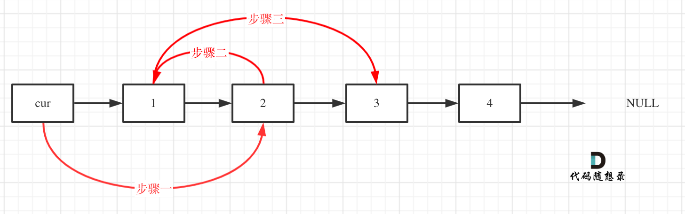

# 24. 两两交换链表中的节点

[24. 两两交换链表中的节点](https://leetcode.cn/problems/swap-nodes-in-pairs/)  
[24. 两两交换链表中的节点 解题思路](https://www.programmercarl.com/0024.%E4%B8%A4%E4%B8%A4%E4%BA%A4%E6%8D%A2%E9%93%BE%E8%A1%A8%E4%B8%AD%E7%9A%84%E8%8A%82%E7%82%B9.html#_24-%E4%B8%A4%E4%B8%A4%E4%BA%A4%E6%8D%A2%E9%93%BE%E8%A1%A8%E4%B8%AD%E7%9A%84%E8%8A%82%E7%82%B9)

- 时间复杂度：O(n)
- 空间复杂度：O(1)